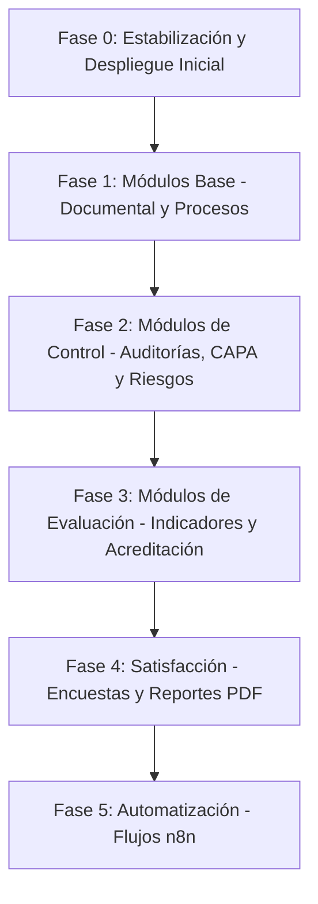

# Plan de Implementación por Fases (SGC-UNT)

Este documento detalla el análisis del estado actual del Sistema de Gestión de la Calidad (SGC) de la Universidad Nacional de Trujillo y define un plan de desarrollo estructurado en fases para completar y estabilizar el sistema. 

El primer objetivo es resolver los errores críticos del código actual que impiden su inicio/despliegue para lograr que compile y funcione "tal como está". Luego, se propone un avance secuencial por módulos (priorizando Gestión Documental y Procesos como base estructural) y dejando la automatización con n8n al final.

---

## Análisis del Estado Actual y Bloqueadores de Despliegue

Tras revisar los archivos en el espacio de trabajo y compararlos con la especificación de [DOCUMENTACION-SISTEMA.md](file:///c:/Users/Zaleth/Documents/PROYECTOS/sgc-2026/DOCUMENTACION-SISTEMA.md), se identificaron múltiples fallos críticos que causan que el sistema falle inmediatamente al compilar o ejecutar:

1. **Error de Sintaxis de Importación en el Backend**:
   - En [routes/index.js](file:///c:/Users/Zaleth/Documents/PROYECTOS/sgc-2026/backend/src/routes/index.js#L4) se importa `authController.j` en lugar de `authController.js` (extensión rota).
2. **Controlador Inexistente en el Backend**:
   - En [routes/index.js](file:///c:/Users/Zaleth/Documents/PROYECTOS/sgc-2026/backend/src/routes/index.js#L12) se importa `encuestaController.js`, pero dicho archivo **no existe** en la carpeta `backend/src/controllers/`, lo que provoca que Node.js lance un error de módulo no encontrado e interrumpa el arranque.
3. **Relaciones Sequelize Faltantes o Incompletas**:
   - Varias consultas en los controladores del backend hacen uso de asociaciones de base de datos (`include: [...]`) que **no están declaradas** en [models/index.js](file:///c:/Users/Zaleth/Documents/PROYECTOS/sgc-2026/backend/src/models/index.js). Esto causará errores `EagerLoadingError` inmediatos al invocar las rutas de la API:
     - `Documento` no está asociado con `Usuario` como `creadoPor` (usado en `documentoController.js`).
     - `PlanAuditoria` no está asociado con `Usuario` como `lider` (usado en `auditoriaController.js`).
     - `PlanAuditoria` no tiene la relación `hasMany` con `Hallazgo` como `hallazgos` (usado en `reporteAuditoria`).
     - `Hallazgo` no está asociado con `Usuario` como `creadoPor` (usado en `auditoriaController.js`).
     - `Autoevaluacion` no tiene la relación `hasMany` con `EvaluacionCriterio` como `evaluaciones` (usado en `acreditacionController.js`).
     - `Proceso` no tiene la relación `hasMany` con `ActividadProceso` como `actividades` (usado en `procesoController.js`).
     - `ActividadProceso` no está asociado con `Usuario` como `responsable` (usado en `procesoController.js`).
4. **Error de Alias en Query de Capas**:
   - En [capaController.js](file:///c:/Users/Zaleth/Documents/PROYECTOS/sgc-2026/backend/src/controllers/capaController.js#L8), el include de `Hallazgo` no especifica el alias `as: 'hallazgo'`. Sequelize requiere incluir el alias si la relación fue definida con él, arrojando un error de asociación inexistente en caso contrario.
5. **Diferencias de Mayúsculas/Minúsculas en Rutas del Frontend**:
   - En todas las páginas del frontend (9 archivos), se importa `@/components/Layout/Sidebar`, pero la carpeta en el sistema de archivos es `components/layout/Sidebar.js` (con `l` minúscula). Esto funciona en Windows (case-insensitive) pero **fallará en entornos Linux/Docker** (case-sensitive) impidiendo compilar el bundle de producción de Next.js.
6. **Axios sin baseURL configurada**:
   - El frontend realiza llamadas a `/api/v1/...` directamente. Al no definir una baseURL para Axios, el navegador intentará enviar las peticiones a `http://localhost:3000` (puerto del frontend) en lugar de a `http://localhost:3001` (puerto de la API backend), arrojando errores 404 en todas las peticiones reales.
7. **Ausencia de un Usuario Semilla (Seed User)**:
   - El archivo [init.sql](file:///c:/Users/Zaleth/Documents/PROYECTOS/sgc-2026/init.sql) no crea ningún usuario inicial. Dado que el sistema tiene páginas de login protegidas, no es posible ingresar ni realizar pruebas tras el despliegue a menos que se inserte un usuario de manera manual o a través del script de base de datos.

---

## User Review Required

> [!IMPORTANT]
> **Usuario Administrador Semilla**: 
> Se propone insertar en `init.sql` un usuario administrador semilla predeterminado para que el sistema pueda ser probado inmediatamente después del despliegue (`docker-compose up`). 
> - **Correo sugerido**: `admin@unitru.edu.pe`
> - **Contraseña sugerida**: `admin123` (encriptada con bcrypt `$2a$10$...`)
>
> **Caso de Mayúsculas/Minúsculas**:
> Se estandarizarán las importaciones del Frontend para usar `@/components/layout/Sidebar` con `l` minúscula, respetando el sistema de archivos físico y garantizando la compatibilidad con Docker/Linux.

---

## Open Questions

> [!WARNING]
> 1. **¿Desea usar las credenciales sugeridas (`admin@unitru.edu.pe` / `admin123`) para el usuario semilla inicial, o prefiere definir otras específicas en esta fase?**
> 2. **¿Desea que configuremos la baseURL de Axios dinámicamente en el frontend usando `process.env.NEXT_PUBLIC_API_URL` (definido en el docker-compose) para evitar configurar URLs estáticas en el código?**

---

## Plan de Implementación por Fases

El proyecto se dividirá en 6 fases lógicas, comenzando por el despliegue del esqueleto actual y priorizando los módulos estructurales centrales antes de avanzar hacia reportes y automatización.



### Fase 0: Estabilización y Despliegue Inicial (Prioridad Inmediata)
**Objetivo**: Resolver todos los errores de sintaxis y configuración para que el sistema se pueda desplegar localmente mediante Docker Compose sin errores de compilación ni de ejecución en las rutas de API básicas.
1. Corregir los imports de `Sidebar` en las 9 páginas del frontend (`Layout` -> `layout`).
2. Configurar la `baseURL` de Axios en `AuthContext.js` usando `process.env.NEXT_PUBLIC_API_URL || 'http://localhost:3001/api/v1'`.
3. Corregir la extensión `.j` en el router del backend.
4. Definir las relaciones faltantes en `models/index.js` (Sequelize).
5. Corregir el alias de `Hallazgo` en el `capaController.js`.
6. Crear un controlador temporal `encuestaController.js` con rutas mockeadas pero sintaxis válida para evitar errores de importación en el backend.
7. Insertar el usuario administrador semilla en `init.sql`.
8. Levantar los contenedores de Docker (`postgres`, `backend`, `frontend`) y validar la conectividad de la base de datos y la pantalla de login.

---

### Fase 1: Módulos Core - Gestión Documental y Mapa de Procesos
**Objetivo**: El mapa de procesos y la gestión documental representan la base de un SGC bajo normas ISO 21001. Todos los demás módulos (riesgos, indicadores, CAPAs) dependen de estas dos entidades.
* **Módulo 1: Gestión Documental**:
  - Modificar el controlador de documentos para soportar la carga real de archivos (usando `multer`).
  - Conectar el frontend (`documentos/page.js`) con la API real para listar, buscar y crear documentos.
  - Implementar el flujo de estados del documento (**borrador → en_revision → aprobado → archivado**).
* **Módulo 2: Mapa de Procesos**:
  - Conectar la API del backend para permitir la creación real de Macroprocesos, Procesos y Actividades.
  - Diseñar el panel en el frontend que permita agregar dinámicamente actividades a un proceso y definir sus entradas, salidas e indicadores.

---

### Fase 2: Módulos de Control - Auditorías, CAPA y Riesgos
**Objetivo**: Habilitar el ciclo de mejora continua y control de desviaciones del sistema.
* **Módulo 4 & 5: Auditorías e Inspecciones & CAPA**:
  - Implementar la creación de planes de auditoría, asignación de equipos y registro de hallazgos.
  - Conectar el flujo completo de CAPA: vincular una acción correctiva a un hallazgo de auditoría y actualizar dinámicamente sus estados (**registrada → en_implementacion → implementada → verificada → cerrada**).
* **Módulo 6: Gestión de Riesgos**:
  - Conectar la API de riesgos con el frontend.
  - Implementar el cálculo automático del nivel de riesgo (`probabilidad * impacto`) en base a la matriz del backend y representarlo visualmente (semáforo de color) en el frontend.
  - Permitir el registro de planes de mitigación asociados.

---

### Fase 3: Módulos de Evaluación - Indicadores y Acreditación
**Objetivo**: Habilitar la medición del rendimiento del SGC.
* **Módulo 7: Indicadores de Gestión**:
  - Conectar el formulario de registro de mediciones del indicador en el frontend.
  - Calcular dinámicamente en el frontend/backend el porcentaje de cumplimiento comparando valor real vs esperado.
  - Reemplazar los datos estáticos del Dashboard principal para consultar métricas dinámicas del backend.
* **Módulo 3: Acreditación y Autoevaluación**:
  - Permitir la definición de estándares (ej. SUNEDU), factores y criterios de evaluación.
  - Implementar la funcionalidad de autoevaluación, sumando los pesos correspondientes a cada factor y guardando evidencias en formato texto o enlace.

---

### Fase 4: Módulo de Satisfacción (Encuestas) y Reportes PDF
**Objetivo**: Completar las funciones de recolección de feedback de la comunidad universitaria y afinar la generación de reportes físicos.
* **Módulo 8: Encuestas**:
  - Remplazar el mock temporal del `encuestaController.js` por lógica real en la base de datos para crear encuestas y preguntas dinámicas.
  - Conectar el formulario dinámico del frontend para renderizar las preguntas Likert 5, Likert 7, Si/No y Abiertas, y registrar las respuestas.
  - Diseñar la pantalla de consolidación de resultados (gráficos de promedios).
* **Generación de PDFs**:
  - Instalar dependencias necesarias para Puppeteer en el contenedor de Docker del backend.
  - Probar y refinar las descargas de reportes PDF en todos los módulos (Gestión Documental, Procesos, Auditorías, CAPA, etc.).

---

### Fase 5: Automatización e Integración de Workflows en n8n
**Objetivo**: Habilitar el motor de workflows de n8n para enviar notificaciones y automatizar procesos administrativos.
1. Configurar y securizar la interfaz web de n8n en el puerto `5678`.
2. Crear e importar los Workflows de n8n (archivos JSON en `workflows/`) para reaccionar a disparadores de la API (webhooks):
   - Alerta al Auditor Líder al crearse un plan de auditoría.
   - Correo electrónico al responsable de una CAPA cuando cambia su estado.
   - Recordatorio automático de revisiones de documentos.
3. Activar los triggers de webhook en n8n y asegurar la comunicación entre los contenedores de backend y n8n en la red compartida de Docker.

---

## Proposed Changes

A continuación se detallan los archivos específicos que se modificarán o crearán en la **Fase 0 (Estabilización)** para habilitar el despliegue inmediato.

### Base de Datos
---
#### [MODIFY] [init.sql](file:///c:/Users/Zaleth/Documents/PROYECTOS/sgc-2026/init.sql)
- Insertar un comando SQL para agregar un usuario administrador semilla con contraseña encriptada por defecto:
  ```sql
  -- Usuario semilla: admin@unitru.edu.pe / admin123
  INSERT INTO sgc.usuarios (codigo, nombres, apellidos, correo, contrasena_hash, rol, facultad, escuela, activo)
  VALUES ('ADM-001', 'Admin', 'SGC', 'admin@unitru.edu.pe', '$2a$10$Qj2z.E7cM9fJk3XpLwV0kex8P1nEq3iO3tLw6k6bV7P4w4z9n1HwO', 'admin', 'Ingeniería', 'Sistemas', TRUE);
  ```

#### [MODIFY] [models/index.js](file:///c:/Users/Zaleth/Documents/PROYECTOS/sgc-2026/backend/src/models/index.js)
- Agregar las declaraciones de asociaciones Sequelize faltantes al final del archivo:
  ```javascript
  // Relaciones adicionales requeridas por controladores
  Documento.belongsTo(Usuario, { as: 'creadoPor', foreignKey: 'creado_por' });
  PlanAuditoria.belongsTo(Usuario, { as: 'lider', foreignKey: 'lider_id' });
  PlanAuditoria.hasMany(Hallazgo, { foreignKey: 'plan_id', as: 'hallazgos' });
  Hallazgo.belongsTo(Usuario, { as: 'creadoPor', foreignKey: 'creado_por' });
  Autoevaluacion.hasMany(EvaluacionCriterio, { foreignKey: 'autoevaluacion_id', as: 'evaluaciones' });
  Proceso.hasMany(ActividadProceso, { foreignKey: 'proceso_id', as: 'actividades' });
  ActividadProceso.belongsTo(Usuario, { as: 'responsable', foreignKey: 'responsable_id' });
  ```

### Backend (API Express)
---
#### [MODIFY] [routes/index.js](file:///c:/Users/Zaleth/Documents/PROYECTOS/sgc-2026/backend/src/routes/index.js)
- Corregir en la línea 4 la importación de `authController.j` a `authController.js`.
- Mantener la ruta de encuestas pero enlazada al controlador de estabilización.

#### [NEW] [encuestaController.js](file:///c:/Users/Zaleth/Documents/PROYECTOS/sgc-2026/backend/src/controllers/encuestaController.js)
- Crear un archivo básico de controlador que exporte `listarEncuestas`, `enviarRespuesta` y `obtenerResultados` para resolver el error de importación y retornar estructuras JSON vacías o mocks mientras se llega a la Fase 4.

#### [MODIFY] [capaController.js](file:///c:/Users/Zaleth/Documents/PROYECTOS/sgc-2026/backend/src/controllers/capaController.js)
- Corregir el `include` de `Hallazgo` añadiendo el alias correspondiente:
  ```javascript
  // Línea 8
  { model: Hallazgo, as: 'hallazgo', attributes: ['descripcion'] }
  ```

### Frontend (Next.js)
---
#### [MODIFY] Todos los archivos de rutas de páginas (9 archivos)
- Modificar el import de Sidebar de `@/components/Layout/Sidebar` a `@/components/layout/Sidebar` en:
  - [acreditacion/page.js](file:///c:/Users/Zaleth/Documents/PROYECTOS/sgc-2026/frontend/src/app/acreditacion/page.js#L2)
  - [auditorias/page.js](file:///c:/Users/Zaleth/Documents/PROYECTOS/sgc-2026/frontend/src/app/auditorias/page.js#L2)
  - [capas/page.js](file:///c:/Users/Zaleth/Documents/PROYECTOS/sgc-2026/frontend/src/app/capas/page.js#L2)
  - [dashboard/page.js](file:///c:/Users/Zaleth/Documents/PROYECTOS/sgc-2026/frontend/src/app/dashboard/page.js#L2)
  - [documentos/page.js](file:///c:/Users/Zaleth/Documents/PROYECTOS/sgc-2026/frontend/src/app/documentos/page.js#L2)
  - [encuestas/page.js](file:///c:/Users/Zaleth/Documents/PROYECTOS/sgc-2026/frontend/src/app/encuestas/page.js#L2)
  - [indicadores/page.js](file:///c:/Users/Zaleth/Documents/PROYECTOS/sgc-2026/frontend/src/app/indicadores/page.js#L2)
  - [procesos/page.js](file:///c:/Users/Zaleth/Documents/PROYECTOS/sgc-2026/frontend/src/app/procesos/page.js#L2)
  - [riesgos/page.js](file:///c:/Users/Zaleth/Documents/PROYECTOS/sgc-2026/frontend/src/app/riesgos/page.js#L2)

#### [MODIFY] [AuthContext.js](file:///c:/Users/Zaleth/Documents/PROYECTOS/sgc-2026/frontend/src/context/AuthContext.js)
- Agregar al inicio del archivo la configuración global de Axios para definir el `baseURL` de la API apuntando a la variable de entorno:
  ```javascript
  import axios from 'axios';
  axios.defaults.baseURL = process.env.NEXT_PUBLIC_API_URL || 'http://localhost:3001/api/v1';
  ```

---

## Verification Plan

### Automated Tests
- Ejecutar la compilación del backend en entorno local o contenedor Docker para asegurar que se resuelve toda la carga de módulos:
  ```bash
  cd backend && npm run dev
  ```
- Ejecutar la compilación de Next.js en modo producción para verificar que todas las rutas se construyen sin fallos de importación de Sidebar:
  ```bash
  cd frontend && npm run build
  ```

### Manual Verification
1. Levantar el stack completo usando docker-compose:
   ```bash
   docker-compose up --build
   ```
2. Acceder al portal web a través de `http://localhost:3000/login` e ingresar las credenciales del administrador semilla (`admin@unitru.edu.pe` / `admin123`).
3. Navegar al Dashboard y confirmar que los gráficos iniciales renderizan correctamente.
4. Navegar a los módulos de Gestión Documental y Mapa de Procesos para verificar que se cargan los listados sin disparar errores internos del servidor (500) por Sequelize.
